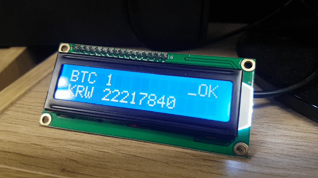
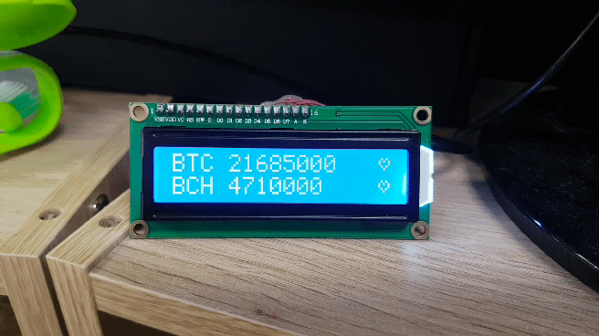
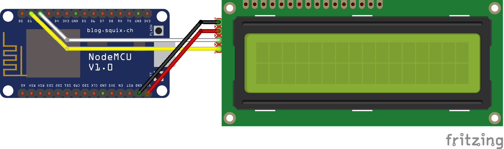

# esp8266-bitcoin-ticker
displaying bitcoin ticker to ESP8266 and IIC LCD display






# circuits



# Setting wifi

```cpp
#include <ESP8266WiFi.h>
const char* ssid     = "SSID";
const char* password = "PASS";
void setup() {
  Serial.begin(115200);
  delay(1000);
  WiFi.disconnect();
  Serial.print("Connecting to ");
  Serial.println(ssid);
  WiFi.begin(ssid, password);
  Serial.println(WiFi.SSID());
  WiFi.setAutoConnect(true);
  WiFi.setAutoReconnect(true);
  WiFi.waitForConnectResult();
  Serial.println(WiFi.localIP());
}

void loop() {}
```

ticker code is in this repository, have fun
